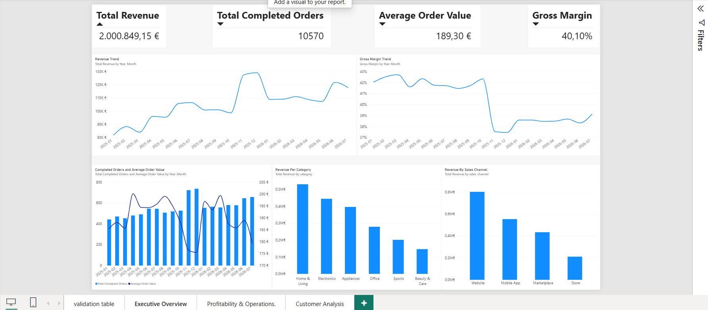
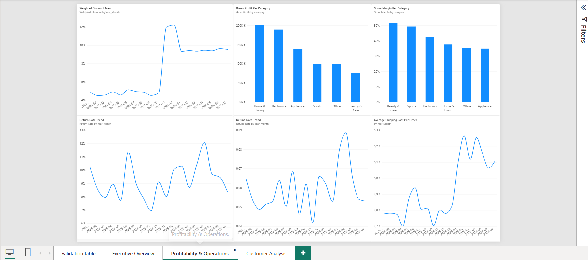
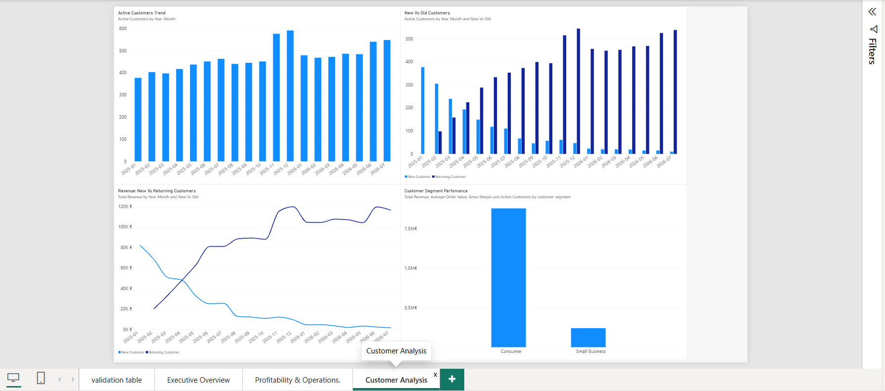

# UrbanCart SQL & Power BI Business Performance Analysis

## Project Overview

UrbanCart is a fictional retail and e-commerce company selling products across multiple categories and sales channels.

The goal of this project was to answer a key management question:

> **Revenue is increasing, but is the business actually becoming healthier and more profitable?**

I used **MySQL** to validate and analyze the data and **Power BI** to build an interactive management dashboard covering sales, profitability, customers, returns, refunds, discounts, and shipping performance.

---

## Tools Used

- MySQL
- MySQL Workbench
- Power BI
- Power Query
- DAX

---

## Dataset

The dataset contains:

- 2,000 customers
- 72 products
- 11,220 orders
- 19,475 order items
- 10,570 completed orders
- 650 cancelled orders
- 1,009 returns

**Analysis period:** January 2025 – July 2026

Main tables:

- `customers`
- `products`
- `orders`
- `order_items`
- `shipments`
- `returns`

---

## Data Quality Checks

Before performing the analysis, I validated the dataset for:

- Missing values
- Duplicate IDs
- Referential integrity
- Invalid quantities or prices
- Completed orders without shipments
- Shipping dates before order dates
- Delivery dates before shipping dates
- Return dates before delivery dates

No major data-quality issues were identified.

The full validation queries are available in:

`sql/data_quality_checks.sql`

---

## Business Analysis

The SQL analysis focused on:

- Monthly Revenue and Orders
- Month-over-Month Revenue Growth
- Average Order Value
- Cancellation Rate
- Active Customers
- New vs Returning Customers
- Category Performance
- Sales Channel Performance
- Discounts and Gross Margin
- Return Rate
- Refund Rate
- Shipping Cost per Order
- Contribution Profitability

The full SQL analysis is available in:

`sql/business_analysis.sql`

---

# Power BI Dashboard

## 1. Executive Overview

The Executive Overview provides a high-level view of sales and profitability performance.

---

## 2. Profitability & Operations

This page investigates the factors affecting the quality of growth.

---

## 3. Customer Analysis

This page focuses on customer behavior and the source of revenue growth.

---

# Key Findings

### Revenue increased, but growth was mainly volume-driven

Revenue showed an overall upward trend.

January 2025 revenue was approximately **€81.98K**, while July 2026 reached approximately **€117.91K**.

November 2025 recorded the strongest month-over-month increase at approximately **29%**.

However, the strongest revenue months also had relatively low Average Order Values of around **€175–€176**.

This suggests that growth was driven primarily by **higher order volume rather than customers spending more per order**.

---

### Higher discounts coincided with lower margins

From November 2025 onward, weighted discounts increased noticeably while Gross Margin declined.

This suggests that increased promotional activity likely contributed to margin pressure.

Revenue was growing, but the profitability efficiency of that growth was weakening.

---

### High revenue does not necessarily mean high margin efficiency

**Home & Living** generated the highest revenue, followed by **Electronics**.

Electronics also led in order and unit volume but had a lower AOV of approximately **€130**, compared with approximately **€164** for Home & Living.

Smaller categories showed stronger Gross Margin percentages:

- Beauty & Care: ~51.6%
- Sports: ~49.3%
- Electronics: ~42.5%
- Home & Living: ~37.7%

This shows the difference between **total profit contribution** and **margin efficiency**.

---

### Marketplace had weaker profitability

The Website was the largest sales channel, accounting for approximately **38.7% of completed orders**.

Gross Margin by channel was approximately:

- Store: 41.6%
- Website: 41.3%
- Mobile App: 41.0%
- Marketplace: 36.0%

Marketplace therefore showed noticeably weaker margin performance.

---

### Returning customers became the main growth driver

Over time:

- Returning customers increased
- Revenue from returning customers increased
- New customers declined
- Revenue from new customers declined

This shows strong repeat purchasing behavior but also highlights a potential risk from weakening customer acquisition.

---

### Return and refund pressure increased

Average Return Rate increased from approximately **8.77%** in Jan–Oct 2025 to approximately **9.67%** afterward.

April 2026 recorded the highest Return Rate at approximately **12.1%**.

Refund Rate also deteriorated during parts of 2026, reaching approximately **8.9%** in April.

---

### Shipping efficiency weakened slightly

Average Shipping Cost per Order remained around **€4.70–€4.94** during most of 2025.

During 2026, it generally increased above **€5 per order**, suggesting a modest increase in fulfillment cost per order.

---

# Business Conclusion

UrbanCart is growing, but the **quality of growth is weakening**.

Revenue growth became increasingly dependent on:

- Higher order volume
- Returning customers
- Increased promotional activity

At the same time:

- Gross Margin declined
- Refund pressure increased
- Shipping cost per order increased
- New-customer acquisition weakened

Therefore, revenue growth alone does not provide a complete picture of the company's performance.

---

## Project Workflow

**Raw Data → Data Validation → SQL Analysis → Power BI Data Model → DAX Measures → Dashboard → Business Insights & Recommendations**
